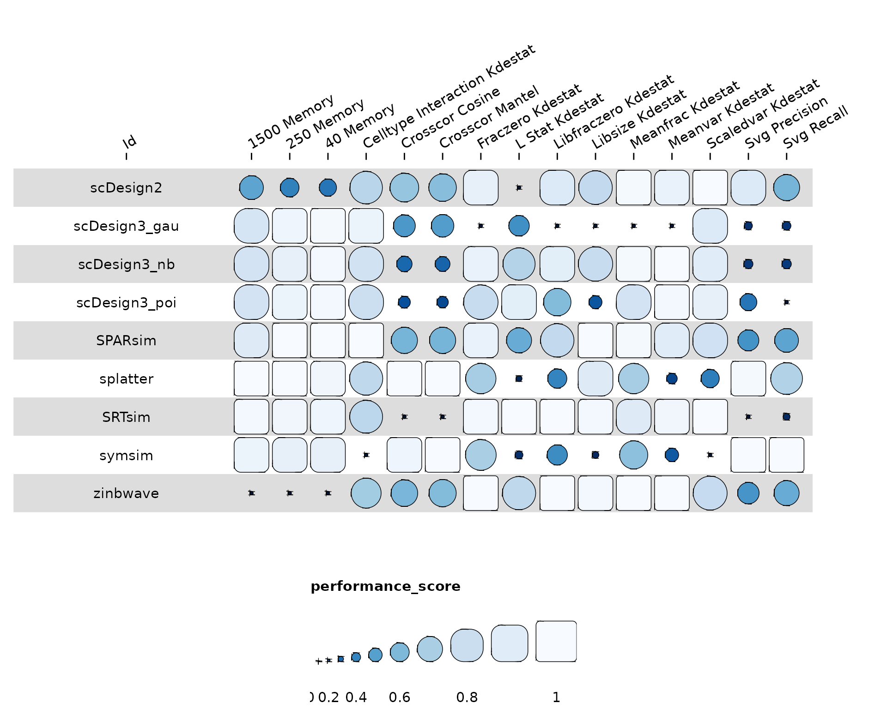
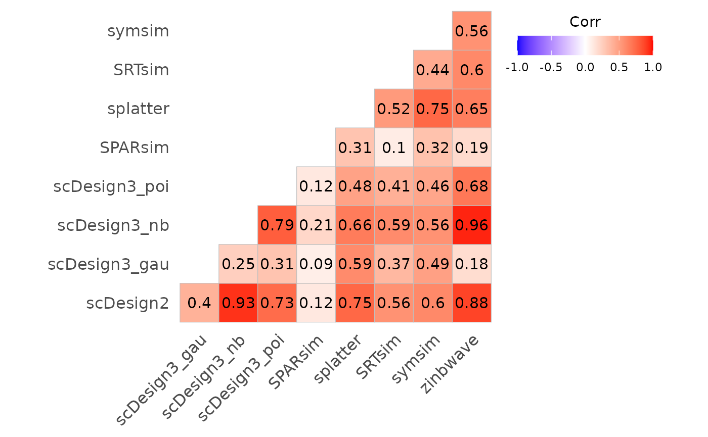
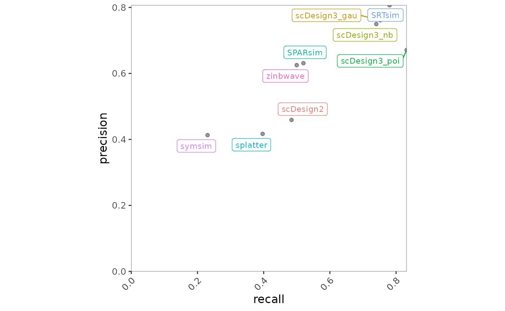
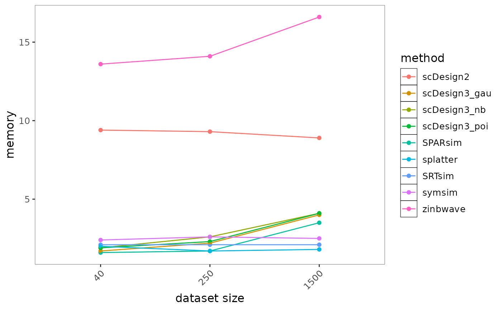
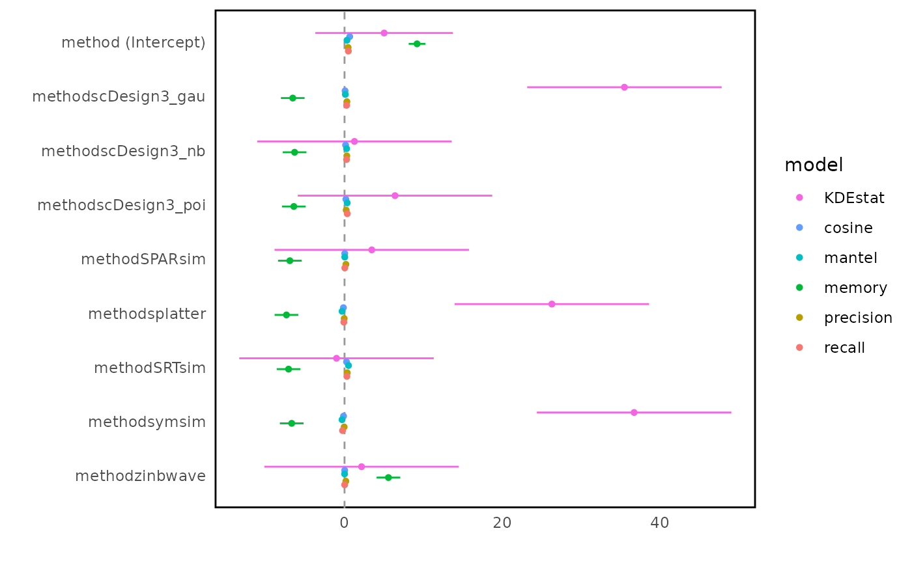
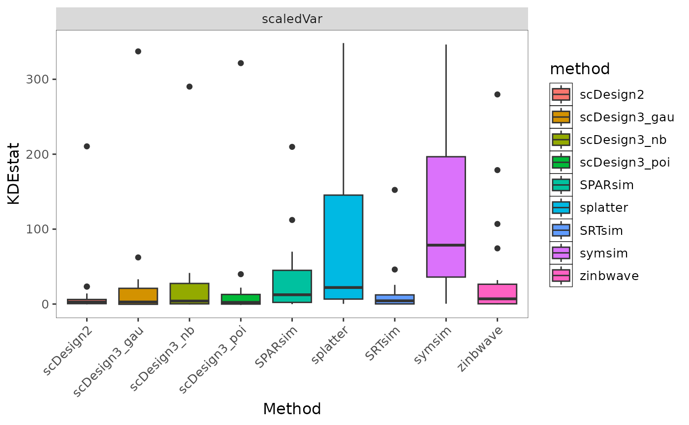

# 3 Introduction of BenchmarkInsights class

``` r
# devtools::load_all()
library(BenchHub)
library(readr)
library(dplyr)
library(stringr)
```

## Motivation

BenchHub—an R ecosystem to make benchmarking easier. It organizes
evaluation metrics, gold standards (Supporting Evidence), and even
provides built-in visualization tools to help interpret results. With
BenchHub, researchers can quickly compare new methods, gain insights,
and actually trust their benchmarking studies. In this vignette, we are
going to introduce BenchmarkInsights class.

## Creating BenchmarkInsights class

`BenchmarkInsights` objects can be created using the corresponding
constructor. For example, if you have a benchmark result formatted in
dataframe, you can create a `BenchmarkInsights` object as follows. The
dataframe includes fixed name columns: `datasetID`, method, evidence,
metric, result. Here I will use the benchmark result from
SpatialSimBench to create a new object.

`BenchmarkInsights` object can be instantiated using their respective
constructors. For example, if you have a benchmark result stored as a
dataframe, you can create a Trio object as follows. The dataframe must
include the following fixed columns: `datasetID`, `method`, `evidence`,
`metric`, and `result`. Here, I demonstrate this using benchmark results
from SpatialSimBench to initialize a new object.

``` r
result_path <- system.file("extdata", "spatialsimbench_result.csv", package = "BenchHub")
spatialsimbench_result <- read_csv(result_path)
glimpse(spatialsimbench_result)
```

    ## Rows: 1,260
    ## Columns: 5
    ## $ datasetID <chr> "BREAST", "HOSTEOSARCOMA", "HPROSTATE", "MBRAIN", "MCATUMOR"…
    ## $ method    <chr> "scDesign2", "scDesign2", "scDesign2", "scDesign2", "scDesig…
    ## $ evidence  <chr> "scaledVar", "scaledVar", "scaledVar", "scaledVar", "scaledV…
    ## $ metric    <chr> "KDEstat", "KDEstat", "KDEstat", "KDEstat", "KDEstat", "KDEs…
    ## $ result    <dbl> -0.18447837, 3.33680301, 6.95418978, 0.62077112, 0.34212005,…

If you use `trio$evaluation()`, the output will be automatically
formatted as the required dataframe. However, if you use your own
benchmark evaluation results, you ensure they adhere to the expected
format.

``` r
bmi <- BenchmarkInsights$new(spatialsimbench_result)
bmi
```

    ## <BenchmarkInsights>
    ##   Public:
    ##     addevalSummary: function (additional_evalResult) 
    ##     addMetadata: function (metadata) 
    ##     clone: function (deep = FALSE) 
    ##     evalSummary: spec_tbl_df, tbl_df, tbl, data.frame
    ##     getBoxplot: function (evalResult, metricVariable, evidenceVariable) 
    ##     getCorplot: function (evalResult, input_type) 
    ##     getForestplot: function (evalResult, input_group, input_model) 
    ##     getHeatmap: function (evalSummary) 
    ##     getLineplot: function (evalResult, order = NULL, metricVariable) 
    ##     getScatterplot: function (evalResult, variables) 
    ##     initialize: function (evalResult = NULL) 
    ##     metadata: NULL

If you have additional evaluation result, you can use
`addevalSummary()`. Here is the example:

``` r
add_result <- data.frame(
  datasetID = rep("BREAST", 9),
  method = c(
    "scDesign2", "scDesign3_gau", "scDesign3_nb", "scDesign3_poi",
    "SPARsim", "splatter", "SRTsim", "symsim", "zinbwave"
  ),
  evidence = rep("svg", 9),
  metric = rep("recall", 9),
  result = c(
    0.921940928, 0.957805907, 0.964135021, 0.989451477, 0.774261603,
    0.890295359, 0.985232068, 0.067510549, 0.888185654
  ),
  stringsAsFactors = FALSE
)

bmi$addevalSummary(add_result)
```

If you add additional metadata of method, you can use `addMetadata()`.
Here is the example:

``` r
metadata_srtsim <- data.frame(
  method = "SRTsim",
  year = 2023,
  packageVersion = "0.99.6",
  parameterSetting = "default",
  spatialInfoReq = "No",
  DOI = "10.1186/s13059-023-02879-z",
  stringsAsFactors = FALSE
)

bmi$addMetadata(metadata_srtsim)
```

## Visualization

### Available plot

`getHeatmap(evalReuslt)`: Creates a heatmap from the evaluation summary
by averaging results across datasets.

- evalResult: A dataframe containing the evaluation summary.
- Note: In this heatmap, it averages results across datasets.

`getCorplot(evalReuslt, input_type)`: Creates a correlation plot based
on the provided evaluation summary.

- evalResult: A dataframe containing the evaluation summary.
- input_type: either “evidence”, “metric”, or “method”.

`getBoxplot(evalReuslt)`: Creates a boxplot based on the provided
evaluation summary.

- evalReuslt: A dataframe containing the evaluation summary.
- input_type: either “evidence”, “metric”, or “method”.

`getForestplot(evalReuslt, input_group, input_model)`: Create a forest
plot using linear models based on the comparison between groups in the
provided evaluation summary.

- evalReuslt: A dataframe containing the evaluation summary.
- input_group: A string specifying the grouping variable (only
  “datasetID”, “method”, or “evidence” allowed).
- input_model: A string specifying the model variable (only “datasetID”,
  “method”, or “evidence” allowed).

`getScatterplot(evalReuslt, variables)`: a scatter plot for the same
evidence, with two method metrics.

- evalReuslt: A dataframe containing the evaluation summary, only
  include two different metrics, all evidence should be same
- variables: A character vector of length two specifying the metric
  names to be used for the x and y axes.

`getLineplot(evalReuslt, order)`: Creates a line plot for the given x
and y variables, with an optional grouping and fixed x order.

- evalReuslt: A dataframe containing the evaluation summary.
- order: An optional vector specifying the order of x-axis values.

### Interpretation benchmark result

#### Case Study: What is the overview of summary?

To get a high-level view of method performance, we use a heatmap to
summarize evaluation results across datasets. This helps identify
overall trends, making it easier to compare methods and performance
differences.

``` r
bmi$getHeatmap(bmi$evalSummary)
```



#### Case Study: What is the correlation between evidence/metric/method?

To understand the relationships between different evaluation factors, we
use a correlation plot to examine how evidence, metrics, and methods are
interrelated. This helps identify patterns, redundancies, or
dependencies among evaluation components.

``` r
bmi$getCorplot(bmi$evalSummary, "method")
```



To further investigate the relationship between two specific metrics, we
use a scatter plot. This visualization helps assess how well two metrics
align or diverge across different methods, providing insights into
trade-offs and performance consistency.

``` r
bmi$getScatterplot(bmi$evalSummary, c("recall", "precision"))
```



#### Case Study: What is the time and memory trend?

To evaluate the scalability of different methods, we use a line plot to
visualize trends in computational time and memory usage across different
conditions. This helps identify how methods perform as data complexity
increases, revealing potential efficiency trade-offs.

``` r
bmi$getLineplot(bmi$evalSummary, metricVariable = "memory")
```



#### Case Study: Which metric is most effective on the method?

To assess which metrics have the strongest influence on method
performance, we use a forest plot to visualize the relationship between
metrics and methods. This allows us to quantify and compare the impact
of different metrics, helping to identify the most critical evaluation
factors.

``` r
bmi$getForestplot(bmi$evalSummary, "metric", "method")
```



#### Case Study: How does method variability differ across datasets for a specific metric?

To examine the consistency of each method across different datasets for
a given metric, we use a boxplot. This visualization helps assess the
variability of method performance, highlighting robustness or
instability when applied to different datasets.

``` r
bmi$getBoxplot(bmi$evalSummary, metricVariable = "KDEstat", evidenceVariable = "scaledVar")
```



### Cheatsheet

|              Question              | Code                                                  |
|:----------------------------------:|:------------------------------------------------------|
|          Summary Overview          | `getHeatmap(evalReuslt)`                              |
|        Correlation Analysis        | `getCorplot(evalReuslt, input_type)`                  |
|  Scalability Trend (Time/ Memory)  | `getLineplot(evalReuslt, order)`                      |
|   Metric-Model Impact (Modeling)   | `getForestplot(evalReuslt, input_group, input_model)` |
| Method Variability Across Datasets | `getBoxplot(evalReuslt)`                              |
|        Metric Relationship         | `getScatterplot(evalReuslt, variables)`               |

## Session Info

``` r
sessionInfo()
```

    ## R version 4.5.2 (2025-10-31)
    ## Platform: x86_64-pc-linux-gnu
    ## Running under: Ubuntu 24.04.3 LTS
    ## 
    ## Matrix products: default
    ## BLAS:   /usr/lib/x86_64-linux-gnu/openblas-pthread/libblas.so.3 
    ## LAPACK: /usr/lib/x86_64-linux-gnu/openblas-pthread/libopenblasp-r0.3.26.so;  LAPACK version 3.12.0
    ## 
    ## locale:
    ##  [1] LC_CTYPE=C.UTF-8       LC_NUMERIC=C           LC_TIME=C.UTF-8       
    ##  [4] LC_COLLATE=C.UTF-8     LC_MONETARY=C.UTF-8    LC_MESSAGES=C.UTF-8   
    ##  [7] LC_PAPER=C.UTF-8       LC_NAME=C              LC_ADDRESS=C          
    ## [10] LC_TELEPHONE=C         LC_MEASUREMENT=C.UTF-8 LC_IDENTIFICATION=C   
    ## 
    ## time zone: UTC
    ## tzcode source: system (glibc)
    ## 
    ## attached base packages:
    ## [1] stats     graphics  grDevices utils     datasets  methods   base     
    ## 
    ## other attached packages:
    ## [1] stringr_1.6.0    dplyr_1.1.4      readr_2.1.6      BenchHub_0.99.5 
    ## [5] BiocStyle_2.38.0
    ## 
    ## loaded via a namespace (and not attached):
    ##   [1] Rdpack_2.6.4           gridExtra_2.3          httr2_1.2.1           
    ##   [4] rlang_1.1.6            magrittr_2.0.4         compiler_4.5.2        
    ##   [7] survAUC_1.4-0          systemfonts_1.3.1      vctrs_0.6.5           
    ##  [10] reshape2_1.4.5         pkgconfig_2.0.3        crayon_1.5.3          
    ##  [13] fastmap_1.2.0          backports_1.5.0        labeling_0.4.3        
    ##  [16] ggstance_0.3.7         rmarkdown_2.30         tzdb_0.5.0            
    ##  [19] ragg_1.5.0             purrr_1.2.0            bit_4.6.0             
    ##  [22] xfun_0.54              cachem_1.1.0           jsonlite_2.0.0        
    ##  [25] tweenr_2.0.3           broom_1.0.10           parallel_4.5.2        
    ##  [28] cluster_2.1.8.1        R6_2.6.1               bslib_0.9.0           
    ##  [31] stringi_1.8.7          RColorBrewer_1.1-3     rpart_4.1.24          
    ##  [34] jquerylib_0.1.4        cellranger_1.1.0       assertthat_0.2.1      
    ##  [37] Rcpp_1.1.0             bookdown_0.45          knitr_1.50            
    ##  [40] base64enc_0.1-3        parameters_0.28.2      Matrix_1.7-4          
    ##  [43] splines_4.5.2          nnet_7.3-20            tidyselect_1.2.1      
    ##  [46] rstudioapi_0.17.1      yaml_2.3.10            curl_7.0.0            
    ##  [49] lattice_0.22-7         tibble_3.3.0           plyr_1.8.9            
    ##  [52] withr_3.0.2            bayestestR_0.17.0      S7_0.2.1              
    ##  [55] evaluate_1.0.5         marginaleffects_0.31.0 foreign_0.8-90        
    ##  [58] desc_1.4.3             survival_3.8-3         polyclip_1.10-7       
    ##  [61] pillar_1.11.1          BiocManager_1.30.27    checkmate_2.3.3       
    ##  [64] insight_1.4.2          generics_0.1.4         vroom_1.6.6           
    ##  [67] hms_1.1.4              ggplot2_4.0.1          scales_1.4.0          
    ##  [70] glue_1.8.0             Hmisc_5.2-4            tools_4.5.2           
    ##  [73] data.table_1.17.8      fs_1.6.6               cowplot_1.2.0         
    ##  [76] grid_4.5.2             tidyr_1.3.1            rbibutils_2.4         
    ##  [79] datawizard_1.3.0       colorspace_2.1-2       googlesheets4_1.1.2   
    ##  [82] patchwork_1.3.2        performance_0.15.2     ggforce_0.5.0         
    ##  [85] htmlTable_2.4.3        googledrive_2.1.2      splitTools_1.0.1      
    ##  [88] Formula_1.2-5          cli_3.6.5              rappdirs_0.3.3        
    ##  [91] textshaping_1.0.4      gargle_1.6.0           funkyheatmap_0.5.2    
    ##  [94] gtable_0.3.6           ggcorrplot_0.1.4.1     ggsci_4.1.0           
    ##  [97] sass_0.4.10            digest_0.6.39          ggrepel_0.9.6         
    ## [100] htmlwidgets_1.6.4      farver_2.1.2           htmltools_0.5.8.1     
    ## [103] pkgdown_2.2.0          lifecycle_1.0.4        MASS_7.3-65           
    ## [106] bit64_4.6.0-1          dotwhisker_0.8.4
